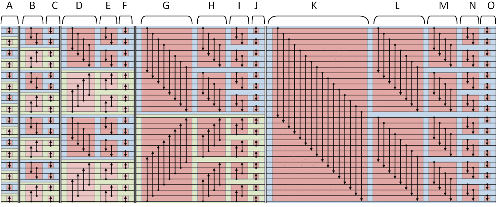

# Bitonic Sort

Tugas CUDA - Bitonic Sort. Praktikum3_K01_13515097

## Petunjuk penggunaan program

1. Buka terminal, jalankan make
    ```
    make
    ```
2. Untuk menjalankan program, ketik
    ```
    ./bitonic_sort <n> <p>
    ```
    - n : problem size / banyaknya elemen random
    - p : thread number (optional) (default : 512)

## Pembagian tugas

| NIM | Nama | Tugas |
| ------ | ------ | ------ |
| 13515097 | Dery Rahman A | All |

## Laporan

### Deskripsi solusi paralel
Bitonic sort merupakan salah satu teknik sorting network yang dapat diparalelkan, dengan kompleksitas O(log<sup>2</sup>n). Konsep bitonic sort sendiri yaitu dengan membuat bitonic subsequence pada tiap iterasinya. Sequence ``0..n`` dikatakan **bitonic increasing** jika terdapat subsequence ``0..a`` menaik, dan ``a..n`` menurun, dan dikatakan **bitonic decreasing** jika terdapat subsequence ``0..a`` menurun, dan ``a..n`` menaik ``(0<=a<=n)``.

Untuk mendapatkan sequence bitonic, dapat dilakukan dengan cara membandingkan 2 buah nilai pada sequence, dengan sequence perbandingan yang independent terhadap data (perbandingan antara 2 nilai dengan perbandingan antara 2 nilai yang lain, tidak saling bergantung). Sehingga, pada titik inilah kita dapat memparalelkan. Solusi ini sama seperti solusi yang diberikan di praktikum 1 OpenMP, hanya saja, operasi perbandingan dilakukan oleh thead didalam GPU.

<div style="text-align:center"></div>
<p style="text-align: center;">Ilustrasi 1.1</p>

Pada ilustrasi, tahap A,B,C,...O dapat dilakukan secara paralel, karena data tidak saling bergantung ketika dilakukan operasi perbandingan.

### Analisis solusi
Pada solusi Bitonic Sort Imperative, operasi perbandingan dilakukan oleh GPU. Dalam hal ini pada fungsi compareAndSwap. Fungsi dijalankan didalam threads GPU. Untuk `t` jumlah thread dalam 1 block, dan jumlah elemen array sebesar `n`, maka jumlah `blocks` sebesar (n+t-1)/t, yaitu banyaknya block yang dibutuhkan, agar 1 tread hanya menangani 1 elemen saja pada array.

```
__device__ __host__ void swap(int* a, int i, int j) {
  int t;
  t = a[i];
  a[i] = a[j];
  a[j] = t;
}

__global__ void compareAndSwap(int* a, int n, int k, int j){
  int i = threadIdx.x + blockDim.x * blockIdx.x;
  int ij=i^j;
  if ((ij)>i) {
    // monotonic increasing
    if ((i&k)==0 && a[i] > a[ij]) swap(a,i,ij);
    // monotonic decreasing
    if ((i&k)!=0 && a[i] < a[ij]) swap(a,i,ij);
  }
}

/*
Imperative paralel bitonic sort
*/
void impBitonicSortPar(int* a, int n, int t) {
  int j,k;
  int blocks = (n+t-1)/t;
  int threads = t;
  dim3 grid_dim(blocks,1);
  dim3 block_dim(threads,1);
  for (k=2; k<=n; k=2*k) {
    for (j=k>>1; j>0; j=j>>1) {
      compareAndSwap<<<grid_dim,block_dim>>>(a, n, k, j);
      cudaDeviceSynchronize();
    }
  }
}
```

Solusi yang saya buat adalah dengan melakukan paralelisasi pada bagian operasi perbandingan. Dengan menggunakan `t` thread, dan jumlah block yang bersesuaian, maka 1 thread hanya akan menghandle 1 elemen array saja. Ratusan atau ribuan thread ini, bekerja secara bersamaan dalam waktu yang sama. Iterasi akan dilanjutkan ketika semua thread telah selesai operasinya. Untuk itu kita perlu menggunakan `cudaDeviceSynchronize()`. Hal ini berguna seperti barrier, dengan menunggu semua thread selesai beroperasi.

### Jumlah thread
Jumlah thread yang digunakan adalah sebanyak t = 512 thread. Saya memilih 512 thread dikarenakan, 512 merupakan maksimum thread yang dapat digunakan setiap blocknya. Walau dengan jumlah thread yang lebih kecil dapat mengurangi  overhead yang timbul dari operasi kontrol pada kernel, namun untuk kasus-kasus jumlah elemen yang besar, tentu lebih baik menggunakan jumlah thread yang besar, sehingga setiap thread hanya bertugas untuk mengoperasikan 1 elemen saja.

### Pengukuran kinerja
Berikut adalah hasil dari pengukuran kinerja dengan jumlah elemen 512, 1.024, 4.096, 65.536, 262.144, 1.048.576, dan 8.388.608. Setiap pengujian dilakukan sebanyak 3 kali dan dihitung rata-ratanya. Dari rata-rata tersebut dihitung speedup dan eficiency nya.


| | N | Percobaan 1 | Percobaan 2 | Percobaan 3 | Avg | Speedup | Eficiency |
| ------ | ------ | ------ | ------ | ------ | ------ | ------ | ------ |
| **Serial time** (micro second) | 512 | 278 | 277 | 277 | 277.333344 | - | - |
| **Paralel time** (micro second) | 512 | 660 | 650 | 642 | 650.666687 | 0.426x | 0.083% |
| **Serial time** (micro second) | 1024 | 671 | 651 | 660 | 660.666687 | - | - |
| **Paralel time** (micro second) | 1024 | 800 | 792 | 800 | 797.333313 | 0.829x | 0.162% |
| **Serial time** (micro second) | 4096 | 3567 | 3895 | 3929 | 3797.000000 | - | - |
| **Paralel time** (micro second) | 4096 | 1135 | 1178 | 1178 | 1163.666626 | 3.263x | 0.637% |
| **Serial time** (micro second) | 65536 | 96357 | 96106 | 95919 | 96127.335938 | - | - |
| **Paralel time** (micro second) | 65536 | 2402 | 2070 | 1947 | 2139.666748 | 44.926x | 8.775% |
| **Serial time** (micro second) | 262144 | 474848 | 474508 | 474467 | 474607.656250 | - | - |
| **Paralel time** (micro second) | 262144 | 2982 | 2926 | 2922 | 2943.333252 | 161.248x | 31.494% |
| **Serial time** (micro second) | 1048576 | 2303411 | 2305610 | 2303725 | 2304248.750000 | - | - |
| **Paralel time** (micro second) | 1048576 | 9224 | 9229 | 9150 | 9201.000000 | 250.435x | 48.913% |
| **Serial time** (micro second) | 8388608 | 24142362 | 24158813 | 24146473 | 24149216.000000 | - | - |
| **Paralel time** (micro second) | 8388608 | 69294 | 68570 | 71234 | 69699.335938 | 346.477x | 67.671% |

### Analisis perbandingan kinerja
Pada percobaan  terlihat bahwa speedup cenderung semakin tinggi ketika problem size ditingkatkan. Hal ini dikarenakan untuk jumlah elemen yang besar, operasi perbandingan yang dilakukan secara serial, dapat dilakukan secara paralel dalam 1 waktu yang sama, sehingga speedup bisa lebih tinggi, karena lebih banyak elemen serial yang dapat diparalelkan. Namun, dengan menggunakan banyak thread, tentu operasi kontrol pada kernel juga banyak, sehingga bisa menjadi overhead untuk kasus dengan problem size yang kecil. Selain itu, dengan problem size yang besar, efisiensi semakin besar pula, dikarenakan setiap thread dalam block tersebut digunakan secara optimal.

### References
- [https://www2.cs.duke.edu/courses/fall08/cps196.1/Pthreads/bitonic.c](https://www2.cs.duke.edu/courses/fall08/cps196.1/Pthreads/bitonic.c)
- [http://www.iti.fh-flensburg.de/lang/algorithmen/sortieren/bitonic/bitonicen.htm](http://www.iti.fh-flensburg.de/lang/algorithmen/sortieren/bitonic/bitonicen.htm)
- [https://gist.github.com/mre/1392067](https://gist.github.com/mre/1392067)
